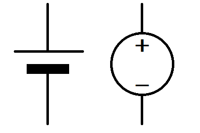

# 전압

한 지점에서 다른 지점으로 전류를 흐르게 하려면, 두 지점 사이에 전압이 있어야만 한다. 도체에 걸린 전압은 도체 내의 모든 자유전자를 밀어내는 데 쓰이는 기전력(electro motive force, EMF)을 일으킨다.

전압 = 전위차(potential difference) = 전위(potential)  
위치에너지(potential energy)라는 말과 혼동 되기 쉽기 때문에 전압이라는 용어를 메인으로 사용한다.

직류 전압원(direct current voltage source) = 양쪽 접속 단자 사이로 일정한 전압을 유지하게 하는 장치

### todo 35p
## 전압 매커니즘
